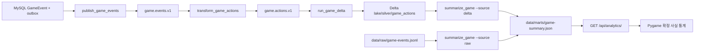

# 17일차 Delta 고유 사실 파이프라인 기획

작성일: 2026-09-28 · 상태: **구현 반영 / 현재 운영 기준**

이 문서는 17일차에 추가된 Delta 저장, Delta 기반 일괄 집계, 분석 API와 로컬 Spark 자원 배치를 하나의 흐름으로 설명한다. 개별 함수 시그니처와 직접 호출은 [서버 라우팅 색인](README.md)의 1:1 문서를 기준으로 한다.

## 1. 목표와 사실의 기준

- MySQL `GameEvent`와 outbox가 서버 확정 사실의 출발점이다.
- Kafka의 `game.events.v1`은 원본 전달 토픽이고 `game.actions.v1`은 Python 변환기가 만든 행동 토픽이다.
- Delta silver 테이블은 `event_id`를 고유 키로 사용한다.
- 같은 사건이 Kafka에서 다시 전달돼도 Delta에는 같은 `event_id`가 한 번만 남아야 한다.
- raw JSONL과 Kafka 전달 기록은 재현·비교용 원본이며 Delta가 원본을 삭제하거나 대체하지 않는다.
- 분석 JSON은 게시된 snapshot이다. API GET이 Spark 작업을 실행하지 않는다.

## 2. 구현된 데이터 흐름



지속 실행 구간은 publisher, 변환기와 `run_game_delta`다. `summarize_game`은 사용자가 선택한 시점에 실행해 고정 snapshot을 게시한다.

## 3. 파일별 책임

| 파일 | 책임 | 직접 경계 |
| --- | --- | --- |
| `server/game/management/commands/inspect_game_facts.py` | DB의 최근 확정 사실을 제한된 공개 필드로 확인 | Django ORM 읽기 전용 |
| `server/analytics/management/commands/run_game_delta.py` | Kafka·Delta package와 작업 인자를 조립해 스트림 제출 | `spark-submit` |
| `spark_jobs/game_actions_delta.py` | Kafka 행동을 검증하고 `event_id` 기준 MERGE | Kafka source·Delta sink |
| `server/analytics/management/commands/summarize_game.py` | raw/delta source와 core 수를 받아 일괄 작업 제출 | `spark-submit` |
| `spark_jobs/game_batch.py` | 선택한 원천을 고유 사건·행동·방별로 집계 | raw reader 또는 Delta reader |
| `server/analytics/views.py` | 게시된 `game-summary.json`을 인증된 GET으로 반환 | 파일 읽기·JsonResponse |
| `tools/start-dev.ps1` | 프로필별 Kafka·Spark Worker·선택적 NiFi 실행 | 별도 PowerShell·Docker Compose |

## 4. Delta 저장 계약

`game_actions_delta.py`는 schema version 1과 `player.moved`, `player.gathered`, `player.trained`만 받는다. 누락된 `event_id`를 새 UUID로 보정하지 않는다.

```text
micro-batch 수신
→ event_id 중복 제거
→ 최초 실행이면 Delta 테이블 생성
→ 이후 실행이면 incoming_actions 임시 뷰 생성
→ batch DataFrame의 SparkSession으로 MERGE 실행
→ saved.event_id와 일치하지 않는 행만 INSERT
→ checkpoint와 progress JSON 갱신
```

checkpoint는 `data/checkpoints/game-actions-delta-v1`, Delta 테이블은 `data/lake/silver/game_actions`, 최근 진행 정보는 `data/marts/progress-game-actions.json`에 둔다.

## 5. 집계와 API 의미

`summarize_game --source raw|delta`가 만드는 `game-summary.json`의 공개 필드는 다음과 같다.

| 필드 | 의미 |
| --- | --- |
| `schema_version` | 현재 게시 계약 버전 1 |
| `generated_at` | 이 집계를 생성한 timezone 포함 시각 |
| `source` | `raw` 또는 `delta` |
| `record_count` | 선택한 원천에서 읽은 전체 행 수 |
| `event_count` | `event_id` 중복 제거 뒤의 고유 확정 사실 수 |
| `by_action` | `event_type`별 고유 사실 수 |
| `by_room` | `room_id`별 고유 사실 수, 상위 20개 |

`record_count`와 `event_count`는 접속자 수, 성공률, 보상량이 아니다. raw에서 중복 전달 행이 있으면 두 값이 다를 수 있고 Delta가 고유 상태라면 같을 수 있다. `summary_view`는 파일이 없을 때 `available=false`, 있을 때 `available=true`와 게시 파일 필드를 반환한다.

## 6. Kafka Windows 안정화

세 Kafka 노드는 `log.cleaner.enable=false`, `log.retention.ms=-1`을 사용한다. Windows가 memory-mapped index를 rename하는 동안 broker log directory가 실패 처리되는 현상을 피하기 위한 로컬 수업 설정이다. 복제, ISR, 토픽 기록과 consumer offset은 유지된다. 데이터가 자동 삭제되지 않으므로 디스크 정리는 세 노드를 모두 종료하고 백업 여부를 확인한 뒤 수행한다.

## 7. 자원 배치

- 기본 `without-nifi` 프로필: Kafka 3노드, Spark Master, Worker 1·2.
- `with-nifi` 프로필: Kafka 3노드, Spark Master, Worker 1과 NiFi Compose.
- Worker 1·2는 각각 4코어·768MB이며 UI는 8081·8082다.
- 계속 실행되는 `run_game_delta`는 total executor core 1로 제한해 Worker 하나만 점유한다.
- Delta 일회성 집계는 `--cores 1|2`를 선택하며 두 번째 Worker의 가용 자원을 사용할 수 있다.

## 8. 실행 순서

```powershell
cd C:\MLO01-01\Chapter3\Game-server
.\start-dev.cmd -Profile without-nifi

cd .\server
```

인프라 준비 뒤 다음 네 명령은 `server` 폴더를 작업 경로로 하는 각각의 별도 터미널에서 계속 실행한다.

```powershell
.\.venv\Scripts\python.exe manage.py runserver --noreload 127.0.0.1:8000
.\.venv\Scripts\python.exe manage.py publish_game_events
.\.venv\Scripts\python.exe manage.py transform_game_actions
.\.venv\Scripts\python.exe manage.py run_game_delta
```

Delta snapshot을 갱신할 때만 별도 터미널에서 실행한다.

```powershell
.\.venv\Scripts\python.exe manage.py summarize_game --data-dir ..\data --source delta --cores 2
```

## 9. 검증 기준

- `inspect_game_facts --rows 3|5|10`으로 DB 식별자와 published 상태를 확인한다.
- `progress-game-actions.json`의 Kafka offset과 batch 진행을 확인한다.
- Delta 집계를 두 번 실행해도 같은 `event_id`의 `event_count`가 증가하지 않는지 확인한다.
- `game-summary.json`의 `source`, `record_count`, `event_count`, 행동·방 배열을 확인한다.
- 인증된 `/api/analytics/` JSON과 Pygame 카드의 값이 일치하는지 확인한다.
- Spark Master UI에서 Delta 스트림과 일회성 집계의 Worker 배치를 확인한다.
- `tools/kafka.ps1 -Action status`와 `-Action describe-topic`으로 세 노드의 voter·ISR과 보존 설정을 확인한다.

## 10. 범위 밖과 후속 작업

현재 구현에는 자동 스케줄 집계, Delta vacuum/retention 정책, 모델 학습, API에서 Spark 작업을 시작하는 기능이 없다. 이 항목은 구현된 구조로 문서화하지 않으며 추가할 경우 별도 계획과 보존 정책을 먼저 정한다.
